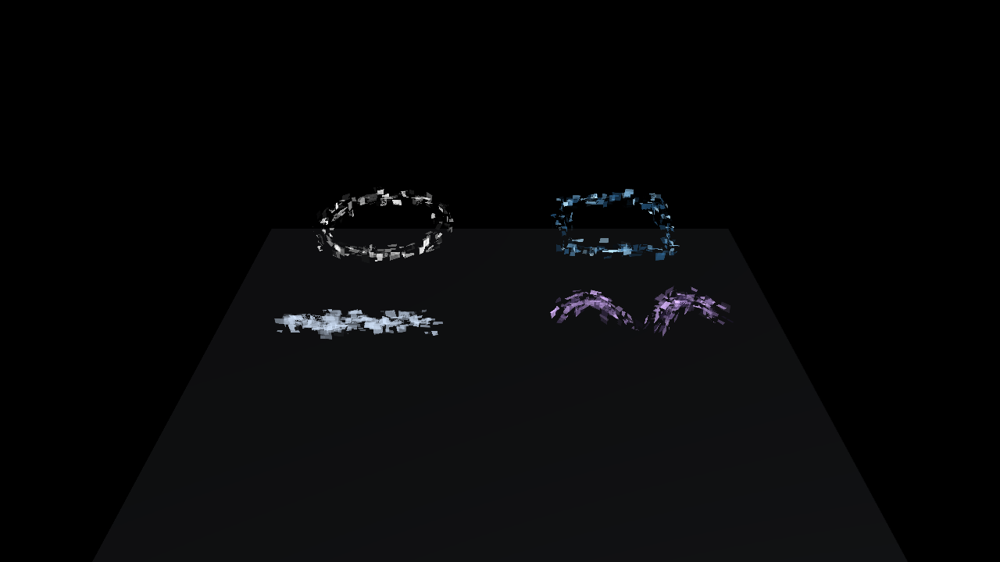

# SabaAccessory の利用例

[Digital Halo ガイド](https://github.com/sabas0ba/vrc_sabaaccessory/blob/main/docs/digital-halo.md#導入)に従い、ALCOM (`vrc-get`) から PC 用 Avatars プロジェクトへ `SabaAccessory Digital Halo` を追加します。

1. `Tools > SabaAccessory > Digital Halo > Import and Open Demo Scene` を実行します。
2. Circle、Quad、Line、Wing の4形状を Scene View と Play Mode で確認します。
3. 自作アバターの Head bone を選択し、`Tools > SabaAccessory > Digital Halo Generator` で Circle を作成します。
4. 生成先の `Assets/SabaAccessory/Generated/` とアバター階層を確認し、PC 向けテストで描画を確認します。

Geometry Shader を使用するため Android／Quest は対象外です。詳細は [使用ガイド](https://github.com/sabas0ba/vrc_sabaaccessory/blob/main/docs/digital-halo.md) を参照してください。

2026-09-23、Unity 2022.3.22f1 で配布デモシーンを取り込み、Main Camera から4形状を描画しました。シーン本体は Git 管理から除外し、[再生成スクリプト](https://github.com/sabas0ba/test_vrc_sabax/blob/main/scripts/run-unity-examples.ps1)でインポートできます。`SabaAccessory/Digital Halo` と `SabaAccessory/Digital Halo Particle` は `Shader.Find` で取得でき、両方 `isSupported=true` でした。[Inspect レポート](reports/digital-halo.md)は0エラー・0警告です。PC VRChat クライアント内の描画は未確認です。

画像は配布デモの Main Camera を Unity Editor のバッチモードで描画した結果です。PC クライアントでの表示や同期を保証するものではありません。
