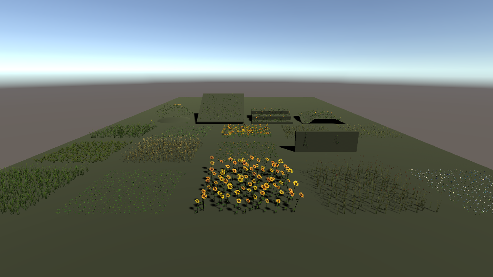
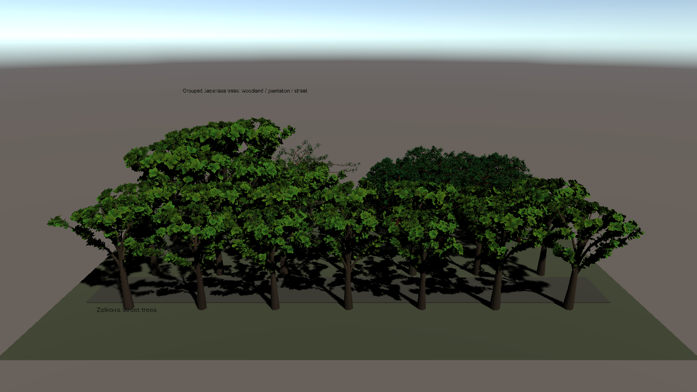
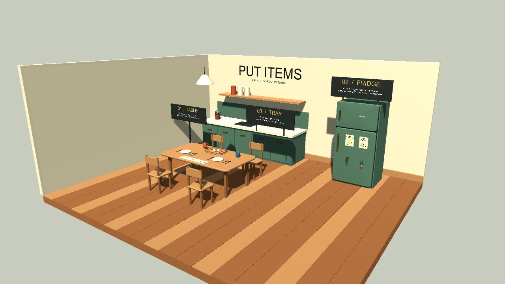
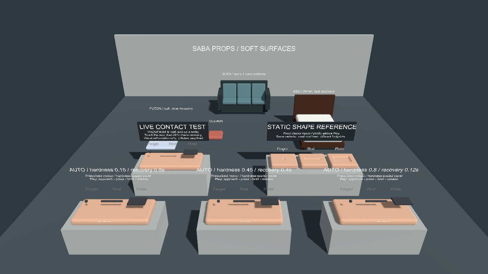

# SabaProps の利用例

配布元の [導入手順](https://github.com/sabas0ba/vrc_sabaprops#vcc-への追加)に従い、ALCOM の `vrc-get` で公開版を導入しました。Foliage 0.6.0 は `projects/foliage/`、Trees 0.1.0、Put Items、Soft Props は `projects/world/` で確認します。Trees は Foliage 0.4.0 を要求するため、二つの Worlds プロジェクトを分けています。

| ケース | 正規の操作 | 確認する結果 |
| --- | --- | --- |
| Foliage Demo | Package Manager で Foliage の `Foliage Demo` Sample を Import。または `Tools > SabaProps > Debug > Foliage > Create Sample Scene` | シーンが開き、草木、共有マテリアル、配置モードを確認できる |
| Trees Demo | Package Manager で Trees の `Trees Demo` Sample を Import | 3 シーンを開き、LOD 切替と樹種の違いを確認できる |
| Trees 生成 | `Tools > SabaProps > Trees > Create Default Assets` → Species の `Rebuild LOD Meshes` → `Create LOD Group in Scene` | Mesh と LODGroup が生成される |
| Put Items | `Tools > SabaProps > Put Items > Open Demo Scene` | Pickup を机・壁へ置いたときの補正と同期を確認できる |
| Soft Props | `Tools > SabaProps > Soft Props > Open Demo Scene` | 家具への接触と復元を PC ワールドの実行時に確認できる |

Foliage と Trees の見た目や配置は Unity Editor、Put Items と Soft Props のワールド内挙動はまず ClientSim を有効にした Game View で確認します。シーンの Play Mode だけで VRChat 固有の複数人同期や Contacts の実機結果を確定しません。

## Unity Editor での結果

2026-09-23、Unity 2022.3.22f1 で Foliage 0.6.0 の生成シーン、Trees 0.1.0 の3シーン、Put Items 0.1.1 と Soft Props 0.2.0 の配布デモを開けました。各バッチ実行で C# コンパイルエラーは0件でした。

導入版と公開アーカイブのハッシュの対応は、[VPM ハッシュ検査](https://github.com/sabas0ba/test_vrc_sabax/blob/main/scripts/check-vpm-hashes.sh)で確認できます。

- Foliage: `Assets/SabaProps/Foliage/Samples/FoliageDemo.unity` に単一種、パラメータ差、地形、混植、出力モード、季節の6区画を生成しました。生成物は容量が大きいため Git 管理から除外し、[再生成スクリプト](https://github.com/sabas0ba/test_vrc_sabax/blob/main/scripts/run-unity-examples.ps1)を用意しています。
- Trees: `Assets/SabaProps/TreesBundledDemo/` に混交林、季節、負荷比較の3シーンを生成しました。生成物は Git 管理から除外しています。Game View 用の World Descriptor を追加しました。[Inspect レポート](reports/trees.html)には Main Camera の near clip 設定について1件の警告が記録されています。
- Put Items: 配布デモシーンを取り込みました。シーン本体は Git 管理から除外し、同じ再生成スクリプトでインポートできます。[Inspect レポート](reports/putitems.html)は0エラー・0警告です。
- Soft Props: 配布デモシーンを取り込みました。シーン本体は Git 管理から除外し、同じスクリプトでインポートできます。[Inspect レポート](reports/softprops.html)は0エラー・0警告です。

VRChat クライアントでの Pickup 同期と Contact 変形は未確認です。Trees と Foliage の公開版依存関係については [観察記録](observations.html) を参照してください。

## Game View での確認

1. ホスト Unity で、このリポジトリの `projects/world/` を開きます。他の Unity プロジェクトは開きません。
2. [再生成スクリプト](setup.html#開発用ツール)を実行します。配布デモのうち Descriptor がない Trees シーンと自作の SabaShader シーンには、World Descriptor とスポーン地点が追加されます。Put Items と Soft Props の配布デモには元から Descriptor があります。
3. `Assets/SabaProps/PutItemsKitchenDemoV2/PutItemsKitchen.unity` または `Assets/SabaProps/SoftPropsDemoMotion/SoftPropsDemo.unity` を開き、ClientSim が有効であることを確認して Play を押します。Game View で Pickup の配置や家具との接触を操作し、Console のエラーと結果を記録します。
4. Trees は `Assets/SabaProps/TreesBundledDemo/TreesDemo.unity` を開き、スポーン位置と樹木の見え方を確認します。配布デモの Main Camera の near clip は 0.300 のままです。

無人バッチの Play Mode では ClientSim の起動までは確認できましたが、入力取得の `NullReferenceException` が連続したため、Game View の操作結果として扱いません。対話的な Game View 操作は未確認です。[観察記録](observations.html#無人バッチ-play-mode-での-clientsim-入力例外)を参照してください。

## Editor 描画例

以下は Unity 2022.3.22f1 の配布デモシーンを、そのシーンの Main Camera から出力した画像です。元のシーンは [SabaProps](https://github.com/sabas0ba/vrc_sabaprops) の各パッケージに含まれます。VRChat クライアント内の見た目を示すものではなく、ピクセル単位の一致を検査する画像でもありません。[再生成手順](setup.html#開発用ツール)の `-RenderImages` で更新できます。

Foliage 0.6.0 のサンプルシーン。複数の植物種と配置区画を一つのシーンで確認できます。

Trees 0.1.0 のサンプルシーン。樹種別の群植と生成された樹冠を確認できます。

Put Items 0.1.1 のキッチンデモ。テーブル、トレー、冷蔵庫への配置ケースを含みます。配置補正や同期の動作結果はこの静止画からは判断しません。

Soft Props 0.2.0 の接触デモ。複数の硬さと復元設定を並べた構成です。接触時の変形は VRChat クライアントで未確認です。

操作と制約: [Foliage](https://github.com/sabas0ba/vrc_sabaprops/blob/main/Packages/io.github.sabas0ba.sabaprops.foliage/README.md)、[Trees](https://github.com/sabas0ba/vrc_sabaprops/blob/main/Packages/io.github.sabas0ba.sabaprops.trees/README.md)、[Put Items](https://github.com/sabas0ba/vrc_sabaprops/blob/main/Packages/io.github.sabas0ba.sabaprops.putitems/Documentation~/demo-review.md)、[Soft Props](https://github.com/sabas0ba/vrc_sabaprops/blob/main/Packages/io.github.sabas0ba.sabaprops.softprops/Documentation~/demo-review.md)。
