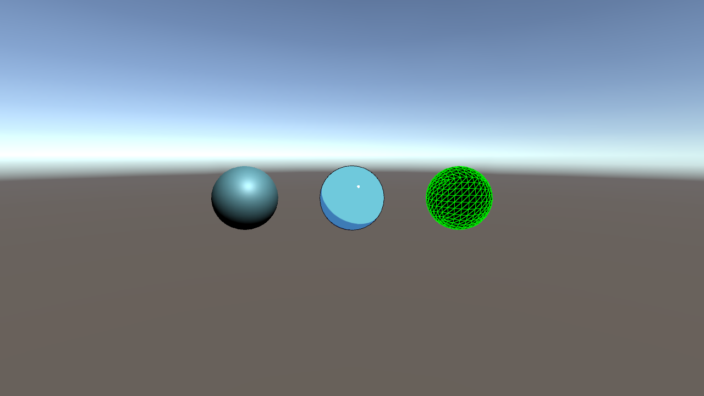
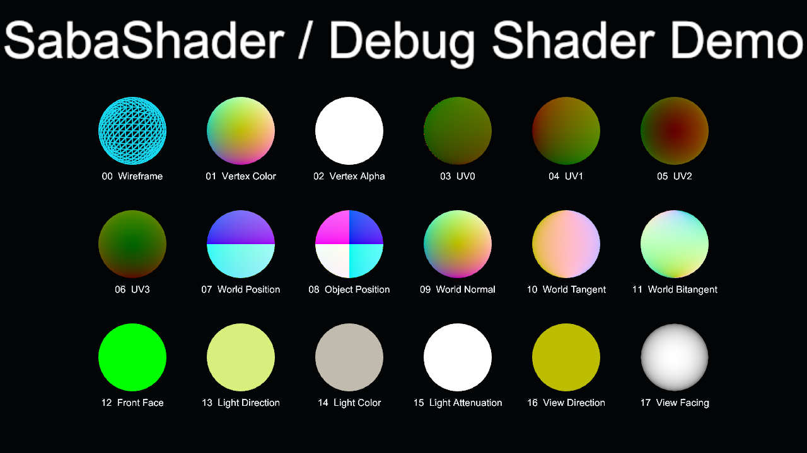

# SabaShader の利用例

[配布元の導入手順](https://github.com/sabas0ba/vrc_sabashader#vcc-で導入する)に従い、SabaShader と Shader Core のリスティングを ALCOM (`vrc-get`) に登録してから、Worlds または Avatars プロジェクトへ `SabaShader` を追加します。

1. 自作の単純な Mesh に適用する Material を複製します。
2. 複製した Material の Shader を `SabaShader/Illust2D` に変更し、Texture／Color と Shade 1／2 を調整します。
3. 同じ Mesh 用の診断 Material を作り、`SabaShader/Debug` の `Display Mode` で UV と法線を確認します。
4. 見た目、Console のエラー、元の Material との差を記録します。ワールドとアバターで結果が異なる場合は両方を記録します。

詳細: [Core Shader 一覧](https://github.com/sabas0ba/vrc_sabashader/blob/main/docs/core-shaders.md)、[Shader 拡張](https://github.com/sabas0ba/vrc_sabashader/blob/main/docs/shader-extensions.md)。Debug の Wireframe は PC 専用です。

2026-09-23、Unity 2022.3.22f1 で [比較シーン](https://github.com/sabas0ba/test_vrc_sabax/blob/main/projects/world/Assets/Examples/SabaShader/CoreShaders.unity)を生成しました。`Standard`、`SabaShader/Illust2D`、`SabaShader/Debug` を同じ球体に適用しています。Standard と Illust2D は同じベース色を設定し、Illust2D の Shade 1／2 を調整しました。両 SabaShader は `Shader.Find` で取得でき、`isSupported=true` でした。[Inspect レポート](reports/sabashader.html)は0エラー・0警告です。

導入版 0.5.0 と依存の Shader Core 0.1.12 は、[VPM ハッシュ検査](https://github.com/sabas0ba/test_vrc_sabax/blob/main/scripts/check-vpm-hashes.sh)で公開リスティングの `zipSHA256` と照合できます。

下図はシーンの Main Camera から出力した Unity Editor 描画です。左が Standard、中央が Illust2D、右が Debug のワイヤーフレーム表示です。[再生成手順](setup.html#開発用ツール)の `-RenderImages` で更新できます。VRChat クライアント内の描画結果ではありません。

## 公式 Debug サンプル

Package Manager に収録された SabaShader 0.5.0 の `Debug Shader Demo` を正規の Import 操作で取り込みました。18表示モードすべてについて、生成された Mesh、`SabaShader/Debug` Material、対応する整数 `_Mode`、Editor 上の Shader 対応状態を [検査レポート](reports/sabashader-debug-sample.html)に記録しています。下図はそのシーンの Main Camera による Unity Editor 描画です。VRChat クライアントでの描画や PC／Quest 間の差は未検証です。

